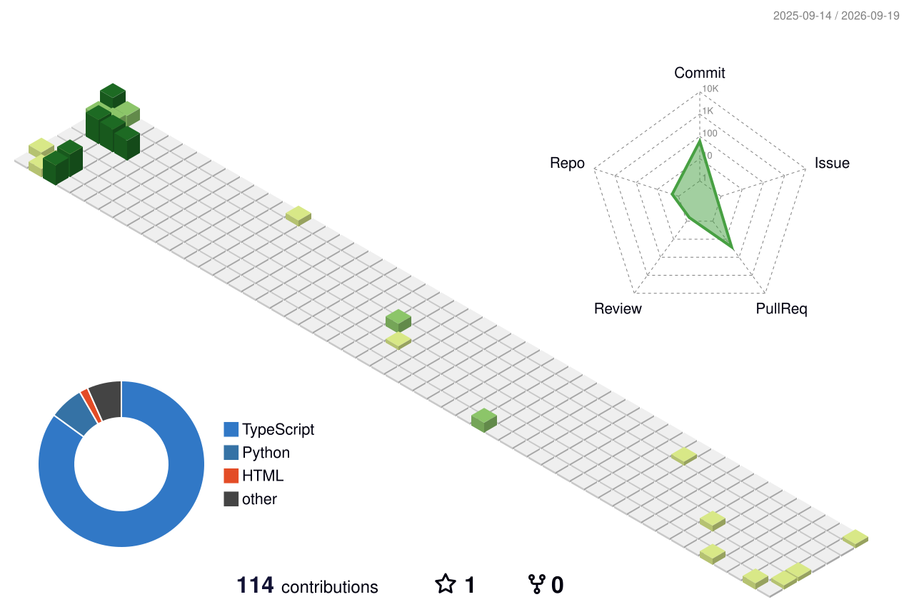

# **HELLO! It's me ZEVEN**.
 

**Welcome to my page!** 

> I'm ZeveNor, you can call me as ZEV. I almost using all time by learning on computer languages, mainly developing in Javascript & Java. Everythings are possible for me! 

### **View Contributes:** 

### **My Code Experience:** 

          

                                                

### **Where to find me**:

[][1] [][2] [][3]

[1]: https://github.com/ZeveNor
[2]: https://steamcommunity.com/id/DE_ZEVEN/
[3]: https://discord.gg/Hw9AqpFCRN
